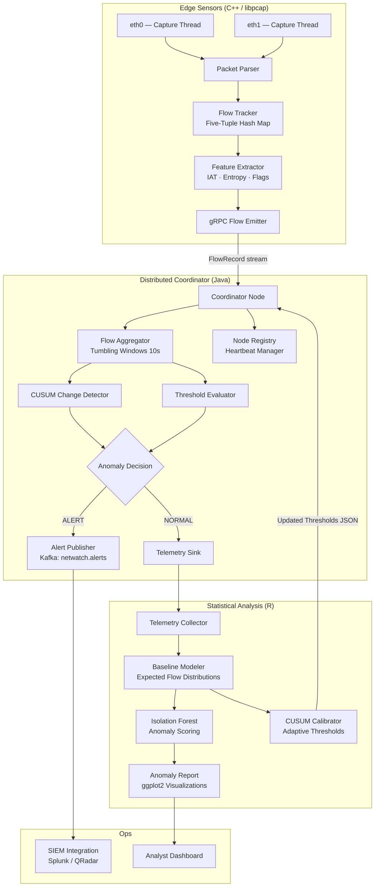
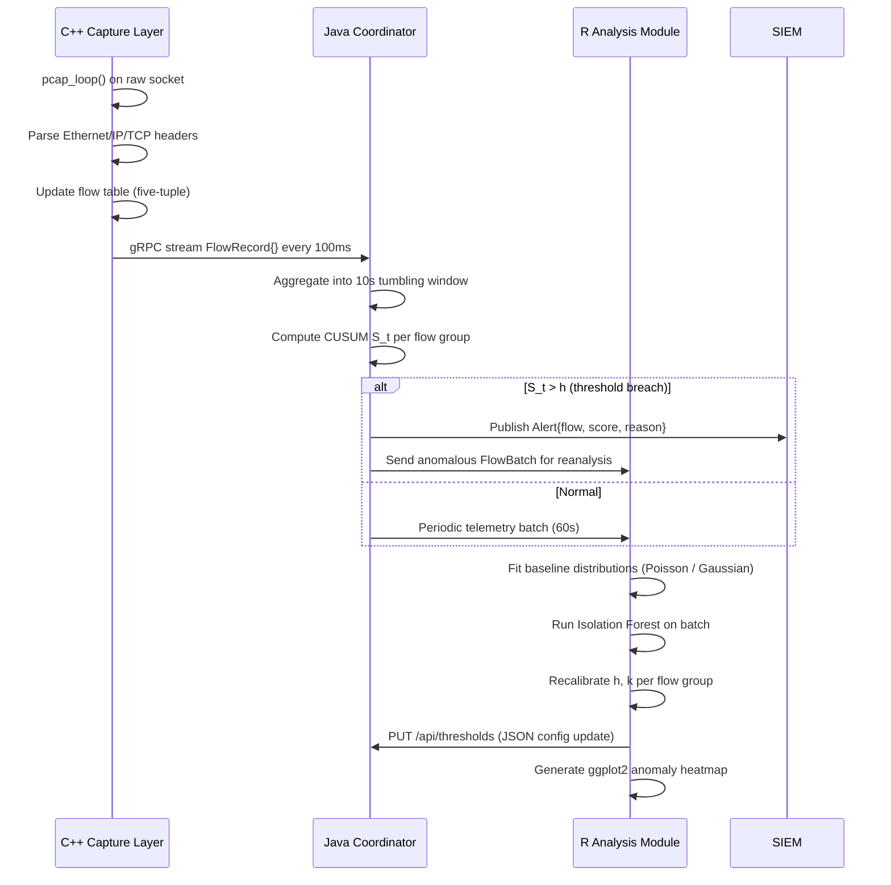

# NetWatch Anomaly Detector

[](https://isocpp.org)
[](https://openjdk.org)
[](https://r-project.org)
[](LICENSE)

A **distributed network packet anomaly detection system** for identifying exfiltration patterns, lateral movement, and volumetric DDoS precursors at wire speed. The C++ capture layer ingests raw packets via `libpcap`, extracts flow-level features, and streams them over gRPC to a Java-based distributed coordinator that orchestrates detection across multiple sensor nodes. An R analysis module ingests the coordinator's aggregated flow telemetry to perform statistical baseline modeling and threshold calibration using **CUSUM** (Cumulative Sum Control Charts) and **Isolation Forest** outlier scoring.

---

## System Architecture



---

## Detection Methodology

### Flow Feature Vector

Each network flow $f$ is represented as a feature vector $\mathbf{x} \in \mathbb{R}^d$:

$$\mathbf{x} = \left[ \bar{\Delta t},\ \sigma_{\Delta t},\ H_{payload},\ \frac{|\text{SYN}|}{|\text{PKT}|},\ \frac{|\text{RST}|}{|\text{PKT}|},\ \bar{L},\ \text{PPM} \right]^T$$

Where:
- $\bar{\Delta t}$ — Mean inter-arrival time (ms)
- $\sigma_{\Delta t}$ — IAT standard deviation (jitter)
- $H_{payload}$ — Shannon payload entropy $\in [0, 8]$ bits
- $\text{SYN}, \text{RST}$ ratios — TCP flag anomaly indicators
- $\bar{L}$ — Mean packet length
- $\text{PPM}$ — Packets per minute (volumetric indicator)

### CUSUM Change Detection

The CUSUM statistic $S_t$ accumulates deviations from a learned baseline $\mu_0$:

$$S_t = \max(0,\ S_{t-1} + (x_t - \mu_0 - k))$$

An alert is raised when $S_t > h$, where $k$ (slack parameter) and $h$ (decision threshold) are calibrated by the R analysis module from historical baseline distributions.

### Isolation Forest

For multivariate anomaly scoring, an Isolation Forest partitions the feature space by randomly selecting split features and values. The anomaly score for observation $x$ is:

$$s(x, n) = 2^{-\frac{E[h(x)]}{c(n)}}$$

where $h(x)$ is the path length in the isolation tree and $c(n)$ is the expected path length normalization factor. Scores $s \geq 0.65$ trigger a **SUSPICIOUS** classification.

---

## Component Flow



---

## Tech Stack

| Component | Technology | Role |
|---|---|---|
| **Packet Capture** | C++20, `libpcap`, POSIX threads | Wire-speed packet ingestion and flow tracking |
| **Coordinator** | Java 21, gRPC, Virtual Threads (Project Loom) | Distributed aggregation and change detection |
| **Statistical Analysis** | R 4.4, `isotree`, `ggplot2`, `data.table` | Baseline modeling, Isolation Forest, calibration |
| **Transport (C++ → Java)** | gRPC + Protobuf 3 | Low-latency flow record streaming |
| **Transport (Java → SIEM)** | Apache Kafka | Durable alert delivery |

---

## Project Structure

```
netwatch-anomaly-detector/
├── capture/                     # C++ capture and feature extraction
│   ├── PacketAnalyzer.cpp        # libpcap loop, header parsing, flow tracking
│   └── Detector.cpp              # Feature computation and gRPC emission
├── coordinator/                  # Java distributed coordinator
│   └── src/main/java/dev/primel/netwatch/
│       ├── Coordinator.java      # gRPC server, flow aggregation, CUSUM
│       └── NodeManager.java      # Sensor node registry and heartbeat manager
├── analysis/                     # R statistical analysis
│   ├── anomaly_model.R           # Baseline fitting, Isolation Forest, calibration
│   └── visualize.R               # ggplot2 heatmaps and telemetry plots
├── proto/
│   └── netwatch.proto
└── README.md
```

---

## Building

```bash
# C++ (requires libpcap-dev, libgrpc++-dev, libprotobuf-dev)
cd capture && cmake -B build -DCMAKE_BUILD_TYPE=Release && cmake --build build

# Java (requires JDK 21+, Maven)
cd coordinator && mvn package -q

# R (requires R 4.4+)
Rscript -e "install.packages(c('isotree','ggplot2','data.table','httr2','jsonlite'))"
```

---

## License

MIT © Primel Jayawardana
